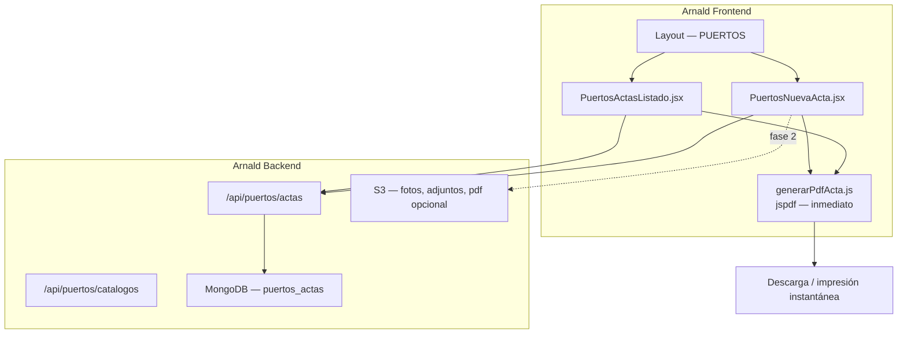

# Maqueta Puertos → Arnald DataFlow

> **Documento de visión y referencia para desarrollo**  
> Plataforma: **Arnald**. Módulo: **Puertos**. Reportes: **PDF inmediato**.  
> Referencia UX externa: sistema legacy en `proserpuertos.com.co/pol` (solo referencia interna, **no** nombre de producto).  
> Última revisión: junio 2026.

---

## 1. Resumen ejecutivo

### Decisiones de producto

| Decisión | Valor |
|----------|-------|
| Nombre del módulo en Arnald | **Puertos** |
| Nombre de plataforma | **Arnald** (nunca “POL” en UI, menús, PDFs ni rutas) |
| Formato de reporte | **PDF**, generado **de inmediato** en el cliente |
| Formato descartado | Word (`.docx`) — no usar en el módulo Puertos |
| Referencia legacy | Sistema externo PHP; solo guía de campos y flujos |

### La gracia del proyecto

Construir en **Arnald** el módulo **Puertos**: gestión de actas de inspección portuaria de mercancía/carga (listado, nueva acta, edición, fotos, facturación), con **descarga o vista previa PDF al instante** al grabar, imprimir o ver una acta.

No extender `reporte-pol` ni usar la etiqueta “POL” en la experiencia de usuario.

---

## 2. Nomenclatura y alcance

### En Arnald (visible al usuario)

| Usar | No usar |
|------|---------|
| Arnald | POL |
| Puertos | POL Versión 2.0 |
| Actas | Reporte POL |
| Generar PDF / Imprimir PDF | Exportar Word |

### Módulos en Arnald (un solo menú PUERTOS)

```
┌─────────────────────────────────────────────────────────────┐
│  ARNALD — Sidebar                                           │
│                                                             │
│  ├─ PUERTOS ▼                                               │
│  │   ├─ Actas y Descargues      /puertos/actas              │
│  │   ├─ Nueva Acta              /puertos/actas/nueva        │
│  │   ├─ Histórico de Actas      /puertos/historico  (fase 2)│
│  │   └─ Inspección Instalaciones /puertos/inspeccion        │
│  │       (formulario de riesgos — hoy /puertos/formulario)  │
│  └─ …                                                       │
└─────────────────────────────────────────────────────────────┘
```

> El formulario de **inspección de instalaciones** (riesgos, infraestructura) convive bajo el mismo menú **Puertos** pero es un submódulo distinto de **Actas**.

### Qué NO es parte de este módulo

| Elemento | Tratamiento |
|----------|-------------|
| `/reporte-pol` | Legacy interno; **no** es Puertos. Deprecar cuando Puertos tenga PDF |
| Menú “Formulario POL” | Eliminar o redirigir a `/puertos/actas` |
| Word / `docx` | Fuera del módulo Puertos |

---

## 3. Reportes PDF inmediatos

### Principio

Cada acta debe poder generar su **PDF en el mismo instante** en que el usuario lo pide, **sin esperar** procesamiento en servidor ni conversión posterior.

```
Usuario → [Grabar] o [PDF] o [Imprimir] en listado
              ↓
    generarPdfActa(datos)  ← jspdf en navegador (< 2 s)
              ↓
    Descarga automática  o  ventana de impresión
```

### Cuándo se genera el PDF

| Acción | Comportamiento |
|--------|----------------|
| **Grabar** acta | Guarda en BD + genera y descarga PDF (o pregunta “¿Descargar PDF?”) |
| **PDF** en formulario | Solo genera y descarga PDF con datos actuales |
| **Imprimir** en listado | Genera PDF y abre diálogo de impresión del navegador |
| **Ver** acta | Vista previa del PDF embebida o panel lateral |

### Stack técnico (ya en el proyecto)

| Librería | Uso en Puertos |
|----------|----------------|
| `jspdf` | Documento PDF, texto, tablas, paginación |
| `html2canvas` | Opcional: capturar sección visual si hace falta layout complejo |
| `file-saver` | Descarga inmediata del blob PDF |

**Ubicación propuesta del generador:**

```
grupoproser-frontend/src/
└── components/PuertosActas/
    ├── utils/generarPdfActa.js    ← plantilla PDF Arnald / Puertos
    ├── PuertosActasListado.jsx
    └── PuertosNuevaActa.jsx
```

### Contenido del PDF (plantilla Arnald)

```
┌────────────────────────────────────────────────────────────┐
│  [Logo Arnald]              PUERTOS — ACTA DE INSPECCIÓN   │
│                             Arnald DataFlow                │
│                                                            │
│  CONTROL PORTUARIO, RISK MANAGEMENT Y AJUSTES DE SINIESTROS│
│  PROSER PUERTOS AJUSTADORES DE SEGUROS                     │
│                                    ┌─────────────────────┐ │
│                                    │ ACTA No. BV635260   │ │
│                                    └─────────────────────┘ │
├────────────────────────────────────────────────────────────┤
│  Información básica | Asegurado | Transporte | Inspección  │
│  Observaciones | Recomendaciones | Firmas                   │
│  [Fotos embebidas si hay]                                  │
├────────────────────────────────────────────────────────────┤
│  Generado en Arnald — {fecha/hora} — {usuario}             │
└────────────────────────────────────────────────────────────┘
```

- Cabecera: **Arnald** + **Puertos** (sin URL legacy ni “POL”).
- Misma estructura de campos que el formulario Nueva Acta (§4).
- Fotos: incrustar en PDF si el tamaño lo permite; si no, anexo “ver en Arnald”.

### Fase 2 (opcional, no bloquea “inmediato”)

- Tras generar PDF en cliente, subir copia a S3 (`pdfRuta`) para historial y re-descarga.
- El usuario **nunca espera** la subida para ver/descargar el PDF.

---

## 4. Pantallas del módulo Puertos

### 4.1 Listado de Actas (`/puertos/actas`)

**Columnas (referencia legacy):**

| Acciones | Datos |
|----------|-------|
| Editar, Ver, **PDF**, Fotos | Nro. Acta, Tipo Inspección, Tipo Avería, Regional, Fecha |
| | Asegurado, Mercancía, Empaque, Nro. Piezas, Pedido |
| | Motonave, Doc. Transporte, Puerto Origen, Remesa |

**Acción PDF en listado:** un clic → PDF inmediato sin abrir el formulario.

```
┌──────────────────────────────────────────────────────────────────┐
│  Puertos — Actas y Descargues              [+ Nueva Acta]        │
├──────────────────────────────────────────────────────────────────┤
│  [Filtros…] [Exportar Excel]                                     │
├────┬────┬────┬────┬──────────┬─────────────┬──────────┬────────┤
│ ✏️ │ 👁 │ 📄 │ 📷 │ Nro.Acta │ Tipo Insp.  │ Regional │ Fecha  │
│    │    │PDF │    │          │             │          │        │
└────┴────┴────┴────┴──────────┴─────────────┴──────────┴────────┘
```

### 4.2 Nueva Acta (`/puertos/actas/nueva`, `/puertos/actas/editar/:id`)

#### Secciones del formulario

1. **Información básica** — Regional*, Nro. Acta*, Fecha Acta*+hora, Fecha Llegada*, Ciudad, Tipo Inspección*, Inspector*, Estado*
2. **Datos del asegurado** — Aseguradora*, Sucursal*, Asegurado*, Mercancía*, Empaque*, Nro. Piezas, Fecha Construcción*, Pedido
3. **Transporte exterior** — País origen/destino, tipo transporte, motonave, puertos, registro, doc. transporte
4. **Transporte interior** — Transportadora, remesa, conductor, cédula, placa, modelo, marca, celular, origen/destino despacho, carta porte
5. **Detalle inspección** — Lugar reconocimiento*, Contacto*, pesos, Avería SI/NO*, Tipo avería
6. **Fotos** — Slots numerados, subir/borrar
7. **Documentos adjuntos** — Upload real (pdf, imágenes, office…)
8. **Facturación** — Valor sugerido, tabla otros gastos, total
9. **Observaciones y recomendaciones** — Rich text

#### Botones del formulario

| Botón | Acción |
|-------|--------|
| **Grabar** | Persiste acta + **PDF inmediato** |
| **PDF** | Genera PDF sin guardar (borrador) |
| **Limpiar** | Resetea formulario (solo creación) |

```
┌──────────────────────────────────────────────────────────────────┐
│  Puertos — Nueva Acta              [Grabar] [PDF] [Limpiar]      │
├──────────────────────────────────────────────────────────────────┤
│  ▼ Secciones 1–9 …                                               │
└──────────────────────────────────────────────────────────────────┘
```

### 4.3 Histórico (`/puertos/historico`) — fase 2

Vista filtrada o archivo; misma acción **PDF** por fila.

---

## 5. Arquitectura



### Rutas frontend

| Ruta | Componente |
|------|------------|
| `/puertos/actas` | `PuertosActasListado` |
| `/puertos/actas/nueva` | `PuertosNuevaActa` |
| `/puertos/actas/editar/:id` | `PuertosNuevaActa` |
| `/puertos/actas/ver/:id` | `PuertosVerActa` |
| `/puertos/historico` | `PuertosHistorico` |
| `/puertos/inspeccion` | `PuertosInspeccionMain` (migrar desde `/puertos/formulario`) |

### API backend (borrador)

| Método | Ruta |
|--------|------|
| GET | `/api/puertos/actas` |
| GET | `/api/puertos/actas/:id` |
| POST | `/api/puertos/actas` |
| PUT | `/api/puertos/actas/:id` |
| DELETE | `/api/puertos/actas/:id` |
| GET | `/api/puertos/actas/export` |
| POST | `/api/puertos/actas/:id/fotos` |
| POST | `/api/puertos/actas/:id/documentos` |
| GET | `/api/puertos/catalogos/:tipo` |

> Sin rutas `/api/pol/*` ni tipo `pol` en historial genérico para este módulo.

---

## 6. Comparativa

| Capacidad | Legacy externo | Arnald hoy | Puertos Arnald (objetivo) |
|-----------|----------------|------------|---------------------------|
| Nombre producto | POL | reporte-pol / Formulario POL | **Puertos** |
| Reporte acta | Imprimir (servidor) | Word cliente | **PDF inmediato** |
| Listado actas | ✅ | ❌ | ✅ |
| Nueva Acta | ✅ | ❌ | ✅ |
| Inspección instalaciones | ❌ | ✅ `/puertos/formulario` | ✅ submódulo |
| Facturación por acta | ✅ | ❌ | ✅ |

---

## 7. Fases de implementación

### Fase 1 — MVP + PDF desde el día 1

- [ ] Menú **PUERTOS** ampliado: Actas, Nueva Acta, Inspección Instalaciones
- [ ] Rutas `/puertos/actas/*`
- [ ] `generarPdfActa.js` con plantilla Arnald (jspdf)
- [ ] Formulario Nueva Acta (secciones 1–5) + **Grabar** + **PDF**
- [ ] Listado básico + icono **PDF** por fila
- [ ] Backend: modelo `PuertosActa` + CRUD

### Fase 2 — Acta completa

- [ ] Fotos, documentos, facturación, rich text
- [ ] Excel en listado
- [ ] Subida opcional PDF a S3 tras generación cliente
- [ ] Histórico de actas

### Fase 3 — Catálogos y permisos

- [ ] API catálogos (regional, inspector, empaque…)
- [ ] Roles y permisos por regional

### Fase 4 — Limpieza

- [ ] Deprecar `/reporte-pol` y redirigir a `/puertos/actas`
- [ ] Quitar “POL” de `Layout.jsx` y `HistorialFormularios`
- [ ] Migrar `/puertos/formulario` → `/puertos/inspeccion` (redirect)

---

## 8. Reutilización de código existente

| Origen | Uso |
|--------|-----|
| `ReportePol/*.jsx` | Solo referencia de **campos**; **no** copiar Word ni textos “POL” |
| `FormularioPuertosModular` | Patrones UI; submódulo Inspección Instalaciones |
| `jspdf` en `package.json` | Motor PDF |
| `FormularioMaquinaria` / `Ajuste` | Patrón edición `/editar/:id`, S3 fase 2 |

---

## 9. Glosario

| Término | Significado |
|---------|-------------|
| **Arnald** | Plataforma Grupo Proser |
| **Puertos** | Módulo Arnald de actas de inspección portuaria de carga |
| **Acta** | Registro operativo (Nro. BV…, regional, mercancía, transporte…) |
| **PDF inmediato** | Generación en navegador al instante; sin cola ni conversión servidor |
| **Legacy externo** | `proserpuertos.com.co/pol` — referencia UX, no nombre de producto |
| **Inspección instalaciones** | Submódulo de riesgos en plantas/port facilities |

---

## 10. Referencias

| Recurso | Ruta |
|---------|------|
| Maqueta anterior (obsoleta) | `docs/MAQUETA-POL-ARNALD.md` → reemplazada por este documento |
| Inspección instalaciones | `src/components/FormularioPuertosModular/` |
| reporte-pol (deprecar) | `src/components/ReportePol/` |
| Menú | `src/components/Layout.jsx` |
| jspdf | `package.json` |

---

*Módulo **Puertos** en **Arnald**. Reportes en **PDF inmediato**. Sin nomenclatura POL en producto.*
